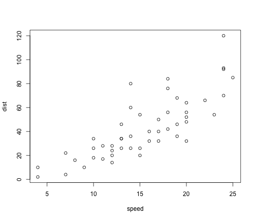

Title
========================================================

This is an R Markdown document. Markdown is a simple formatting syntax for authoring web pages (click the **MD** toolbar button for help on Markdown).

When you click the **Knit HTML** button a web page will be generated that includes both content as well as the output of any embedded R code chunks within the document. You can embed an R code chunk like this:

##prepare for the plots

```r
set.seed(1234)
library(ggplot2)
library(lattice)
setwd("/Volumes/ifs/scratch/c2b2/ac_lab/jh3283/projAML/WXS/reports/result_labmetgNov")
scatterPlot = function(X, Y, label, title) {
    xyLimits = c(min(X, Y), max(X, Y))
    plot(X, Y, xlab = "Relapse patient", ylab = "Tumor patients", main = title, 
        xlim = xyLimits, ylim = xyLimits, pch = 15, col = "blue")
    abline(a = 0, b = 1, col = "gray")
    text(x = X, y = Y * (1 - 0.02), labels = label, cex = 0.5)
}
```


You can also embed plots, for example:


```r
plot(cars)
```

 


